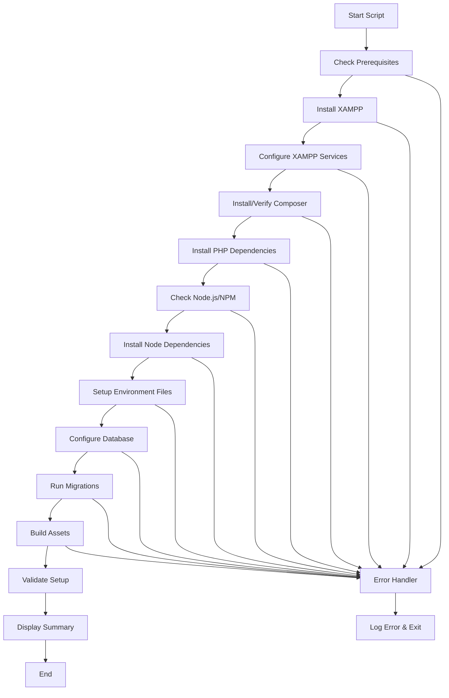

# Design Document - Build Automation Script

## Overview

The build automation script will be implemented as a PowerShell script that automates the complete setup of a development environment for the energy monitoring application. The script will handle XAMPP installation, PHP/Composer setup, Node.js dependencies, database configuration, and environment setup in a sequential, error-resilient manner.

## Architecture

### Script Structure
```
build-setup.ps1 (Main script)
├── Configuration Section (Variables and settings)
├── Utility Functions (Logging, error handling, validation)
├── Installation Modules
│   ├── XAMPP Installation & Configuration
│   ├── Composer Installation & Setup
│   ├── Node.js Dependency Check
│   └── Database Setup & Migration
├── Environment Configuration
└── Validation & Summary
```

### Execution Flow


## Components and Interfaces

### 1. Configuration Manager
**Purpose**: Centralized configuration and environment detection
**Functions**:
- `Get-SystemInfo()`: Detect Windows version, architecture, and existing installations
- `Set-ScriptConfig()`: Define download URLs, paths, and default settings
- `Test-Prerequisites()`: Verify system requirements and permissions

### 2. XAMPP Manager
**Purpose**: Handle XAMPP installation and configuration
**Functions**:
- `Install-XAMPP()`: Download and install XAMPP silently
- `Configure-XAMPPServices()`: Set up Apache and MySQL as Windows services
- `Start-XAMPPServices()`: Start and verify Apache/MySQL services
- `Test-XAMPPInstallation()`: Validate XAMPP is working correctly

### 3. Dependency Manager
**Purpose**: Manage PHP and Node.js dependencies
**Functions**:
- `Install-Composer()`: Download and install Composer globally
- `Install-PHPDependencies()`: Run composer install in energy-monitor directory
- `Test-NodeJS()`: Check Node.js and NPM availability
- `Install-NodeDependencies()`: Run npm install and npm run build

### 4. Database Manager
**Purpose**: Configure database and run migrations
**Functions**:
- `Setup-Database()`: Create database and configure connection
- `Run-Migrations()`: Execute Laravel migrations
- `Test-DatabaseConnection()`: Verify database connectivity

### 5. Environment Manager
**Purpose**: Handle environment file configuration
**Functions**:
- `Setup-EnvironmentFile()`: Copy and configure .env file
- `Generate-AppKey()`: Generate Laravel application key
- `Configure-DatabaseSettings()`: Update database connection settings

### 6. Logger and Error Handler
**Purpose**: Provide logging and error management
**Functions**:
- `Write-Log()`: Write timestamped log entries
- `Write-Error()`: Handle and log errors with context
- `Show-Progress()`: Display progress indicators
- `Show-Summary()`: Display final setup summary

## Data Models

### Script Configuration Object
```powershell
$Config = @{
    XAMPPVersion = "8.2.12"
    XAMPPDownloadUrl = "https://sourceforge.net/projects/xampp/files/XAMPP%20Windows/"
    ComposerUrl = "https://getcomposer.org/installer"
    ProjectPath = ".\energy-monitor"
    LogFile = "build-setup.log"
    RequiredPHPVersion = "8.1"
    RequiredNodeVersion = "16.0"
}
```

### Installation Status Object
```powershell
$Status = @{
    XAMPP = @{ Installed = $false; Configured = $false; Running = $false }
    Composer = @{ Installed = $false; Dependencies = $false }
    NodeJS = @{ Available = $false; Dependencies = $false; Built = $false }
    Database = @{ Created = $false; Migrated = $false; Connected = $false }
    Environment = @{ Configured = $false; KeyGenerated = $false }
}
```

## Error Handling

### Error Categories
1. **System Errors**: Insufficient permissions, missing prerequisites
2. **Download Errors**: Network issues, invalid URLs, corrupted downloads
3. **Installation Errors**: Failed installations, configuration issues
4. **Service Errors**: Failed to start services, port conflicts
5. **Application Errors**: Migration failures, dependency conflicts

### Error Recovery Strategies
- **Retry Logic**: Automatic retry for network-related operations (3 attempts)
- **Rollback Capability**: Ability to undo partial installations
- **Alternative Paths**: Fallback URLs for downloads
- **User Guidance**: Clear error messages with suggested solutions
- **Logging**: Detailed error logging for troubleshooting

### Error Response Format
```powershell
function Handle-Error {
    param($ErrorMessage, $ErrorCode, $SuggestedAction)
    
    Write-Log "ERROR: $ErrorMessage" -Level "Error"
    Write-Host "❌ $ErrorMessage" -ForegroundColor Red
    Write-Host "💡 Suggested Action: $SuggestedAction" -ForegroundColor Yellow
    
    # Log to file with full context
    # Offer retry or exit options
}
```

## Testing Strategy

### Unit Testing Approach
- **Function Testing**: Test individual functions with mock data
- **Integration Testing**: Test component interactions
- **System Testing**: Test on clean Windows environments

### Test Scenarios
1. **Fresh Installation**: Clean system with no existing software
2. **Partial Installation**: System with some components already installed
3. **Upgrade Scenario**: Existing older versions of software
4. **Error Conditions**: Network failures, permission issues, disk space
5. **Different Windows Versions**: Windows 10, Windows 11, different architectures

### Validation Checks
- **Service Status**: Verify Apache and MySQL are running
- **Port Availability**: Check ports 80, 443, 3306 are accessible
- **File Permissions**: Verify write permissions in required directories
- **Database Connectivity**: Test connection to MySQL database
- **Application Response**: Verify Laravel application responds correctly
- **Asset Compilation**: Confirm frontend assets are built and accessible

### Test Data Requirements
- Sample .env.example file for testing environment setup
- Test database schema for migration testing
- Mock download URLs for offline testing
- Test configuration files for various scenarios

## Implementation Notes

### PowerShell Requirements
- **Execution Policy**: Script requires RemoteSigned or Unrestricted policy
- **Administrator Rights**: Required for service installation and configuration
- **PowerShell Version**: Compatible with PowerShell 5.1 and PowerShell 7+

### XAMPP Configuration Specifics
- **Silent Installation**: Use `/S` flag for unattended installation
- **Service Configuration**: Configure Apache and MySQL as Windows services
- **Port Configuration**: Default ports (80, 443, 3306) with conflict detection
- **Security Settings**: Basic security configuration for development environment

### Laravel-Specific Setup
- **Environment File**: Copy from .env.example and configure for XAMPP
- **Database Configuration**: Update to use MySQL instead of SQLite
- **Application Key**: Generate using `php artisan key:generate`
- **Storage Permissions**: Ensure proper permissions for storage and cache directories

### Node.js Integration
- **Version Detection**: Check for compatible Node.js version (16+)
- **Package Installation**: Run `npm install` in energy-monitor directory
- **Asset Building**: Execute `npm run build` to compile Vite assets
- **Development Server**: Optional setup for `npm run dev` command