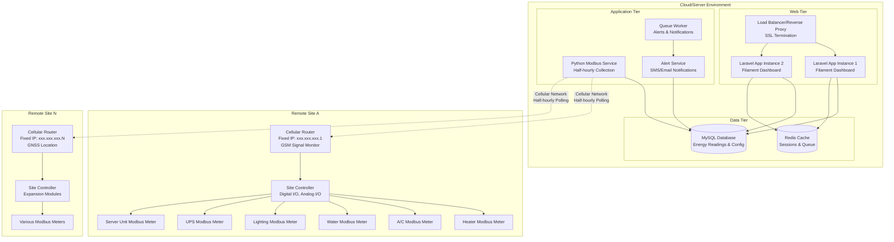

# Deployment Design Document

## Overview

This document outlines the deployment architecture for a remote energy monitoring system that communicates with Modbus meters through cellular routers with fixed IP addresses. The system consists of a Laravel web application with Filament-based modern UI dashboard and a Python Modbus service that collects half-hourly energy consumption data from remote sites. The deployment targets small remote sites monitoring heaters, A/C, water, lighting, UPS, and server units with configurable alerts and usage profiling capabilities.

## Architecture

### High-Level Architecture



### Deployment Strategy

The deployment will use a **Blue-Green deployment** approach with Docker containers orchestrated by Docker Compose on **Ubuntu Server 22.04 LTS** for simplicity, with the option to migrate to Kubernetes for larger scale deployments. The system must support cellular router connectivity with fixed IP addresses, automatic WAN failover capabilities, and real-time widget-based monitoring dashboards.

### Ubuntu Server Requirements

**System Requirements:**
- Ubuntu Server 22.04 LTS (recommended) or 20.04 LTS
- Minimum 4GB RAM, 8GB recommended for production
- 50GB+ storage for application data and logs
- Network connectivity for cellular router communication
- Firewall configuration (UFW) for security

**Required Ubuntu Packages:**
- Docker Engine and Docker Compose
- Nginx (for reverse proxy)
- UFW (Uncomplicated Firewall)
- Certbot (for Let's Encrypt SSL certificates)
- Fail2ban (for intrusion prevention)
- Logrotate (for log management)

## Components and Interfaces

### 1. Laravel Web Application Container

**Technology Stack:**
- PHP 8.1+ with Laravel 10
- Filament 3.0 for admin interface
- Nginx as web server
- PHP-FPM for request processing

**Container Configuration:**
- Base image: `php:8.1-fpm-alpine`
- Exposed ports: 9000 (PHP-FPM)
- Volume mounts: `/var/www/html` for application code
- Environment variables: Database credentials, app configuration

**Dependencies:**
- MySQL database connection
- Redis for caching and sessions
- File storage for logs and uploads

### 2. Python Modbus Service Container

**Technology Stack:**
- Python 3.11+
- pymodbus for Modbus communication
- APScheduler for half-hourly data collection
- requests for HTTP API calls to Laravel
- SMS/Email notification libraries

**Container Configuration:**
- Base image: `python:3.11-slim`
- No exposed ports (internal service)
- Volume mounts: Configuration files, logs
- Network access: Cellular router fixed IPs
- Scheduling: Half-hourly cron jobs for data collection

**Dependencies:**
- Network access to cellular routers with fixed IPs
- HTTP access to Laravel API endpoints
- Configuration file access for site-specific settings
- SMS gateway integration for alerts

### 3. Widget-Based Dashboard System

**Filament Dashboard Components:**
- **Site Overview Widgets:** Real-time status of all remote sites
- **Controller Status Widgets:** Communication status, GSM signal strength, SIM card info
- **Device Monitoring Widgets:** Individual meter readings (heaters, A/C, water, lighting, UPS, servers)
- **Usage Profile Widgets:** Operational hours vs. out-of-hours consumption analysis
- **Alert Management Widgets:** Configurable threshold alerts and notification settings
- **Location Tracking Widgets:** GNSS-based site location monitoring

**Modern UI Design Features:**
- Responsive grid layout for widget arrangement
- Real-time data updates via WebSocket or polling
- Customizable dashboard per user role
- Dark/light theme support
- Mobile-responsive design for field technicians

### 3. Database Layer

**MySQL Configuration:**
- Version: MySQL 8.0
- Storage: Persistent volumes for data
- Backup: Automated daily backups
- Replication: Master-slave setup for high availability

**Redis Configuration:**
- Version: Redis 7.0
- Usage: Session storage, caching, queue backend
- Persistence: RDB snapshots for data recovery

### 4. Reverse Proxy/Load Balancer

**Nginx Configuration:**
- SSL termination with Let's Encrypt certificates
- Load balancing across Laravel instances
- Static file serving
- Rate limiting and security headers

## Data Models

### Environment Configuration

**Production Environment Variables:**

```bash
# Laravel Application
APP_ENV=production
APP_DEBUG=false
APP_URL=https://energy-monitor.yourdomain.com
DB_HOST=mysql
DB_DATABASE=energy_monitor_prod
DB_USERNAME=energy_user
DB_PASSWORD=<secure_password>
REDIS_HOST=redis
QUEUE_CONNECTION=redis
CACHE_DRIVER=redis
SESSION_DRIVER=redis

# Python Modbus Service
LARAVEL_API_URL=http://laravel:9000/api/readings
MODBUS_CONFIG=/app/config/config.json
LOG_LEVEL=WARNING
```

### Database Schema

The deployment will ensure proper database migrations are run with the following key tables:
- `devices` - Modbus device configurations
- `readings` - Energy consumption data
- `users` - Application users
- `jobs` - Queue job tracking
- `cache` - Redis cache fallback

### Configuration Management

**Secrets Management:**
- Database passwords stored in Docker secrets
- API keys managed through environment variables
- SSL certificates managed by Let's Encrypt
- SMS gateway credentials securely stored
- Cellular router authentication tokens

**Site Configuration:**
- Remote site registration portal for adding new locations
- Cellular router fixed IP address management
- Device-specific Modbus register mapping
- Alert threshold configuration per device type
- Operational hours definition per site

## Error Handling

### Application-Level Error Handling

1. **Laravel Application:**
   - Centralized exception handling through Laravel's exception handler
   - Structured logging to files and external services
   - Graceful degradation when external services are unavailable

2. **Python Modbus Service:**
   - Retry logic for failed Modbus connections
   - Circuit breaker pattern for device communication
   - Fallback mechanisms when Laravel API is unavailable

### Infrastructure-Level Error Handling

1. **Container Orchestration:**
   - Health checks for all containers
   - Automatic restart policies
   - Resource limits to prevent resource exhaustion

2. **Database:**
   - Connection pooling and timeout handling
   - Automated backup verification
   - Failover to read replicas when needed

3. **Monitoring and Alerting:**
   - Container health monitoring
   - Application performance monitoring
   - Alert notifications for critical failures

## Testing Strategy

### Pre-Deployment Testing

1. **Unit Tests:**
   - Laravel feature tests for API endpoints
   - Python unit tests for Modbus communication
   - Database migration tests

2. **Integration Tests:**
   - End-to-end API testing
   - Modbus device communication tests
   - Database connectivity tests

3. **Container Testing:**
   - Docker image security scanning
   - Container startup and health check validation
   - Resource usage testing

### Deployment Testing

1. **Staging Environment:**
   - Identical production environment setup
   - Full application testing with sample data
   - Performance and load testing

2. **Production Validation:**
   - Smoke tests after deployment
   - Health check validation
   - Data integrity verification

### Monitoring and Observability

1. **Application Monitoring:**
   - Laravel Telescope for request tracking
   - Custom metrics for Modbus data collection
   - Performance monitoring with APM tools

2. **Infrastructure Monitoring:**
   - Container resource usage monitoring
   - Database performance metrics
   - Network connectivity monitoring

3. **Logging Strategy:**
   - Centralized logging with ELK stack or similar
   - Structured JSON logging
   - Log retention and rotation policies

## Security Considerations

### Network Security
- Firewall rules restricting access to necessary ports only
- VPN or private network for Modbus device communication
- SSL/TLS encryption for all web traffic

### Application Security
- Regular security updates for all dependencies
- Input validation and sanitization
- CSRF protection and secure session handling
- API rate limiting and authentication

### Data Security
- Database encryption at rest
- Secure backup storage
- Access logging and audit trails
- Regular security vulnerability scanning

## Scalability and Performance

### Horizontal Scaling
- Multiple Laravel application instances behind load balancer
- Database read replicas for improved read performance
- Redis clustering for cache scalability

### Performance Optimization
- PHP OPcache for improved PHP performance
- Database query optimization and indexing
- CDN for static asset delivery
- Caching strategies for frequently accessed data

### Resource Management
- Container resource limits and requests
- Database connection pooling
- Queue worker scaling based on load
- Automated scaling policies based on metrics